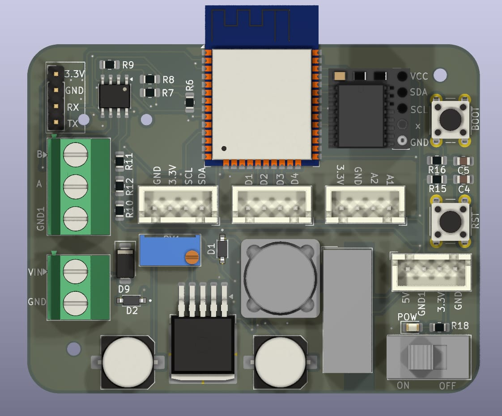
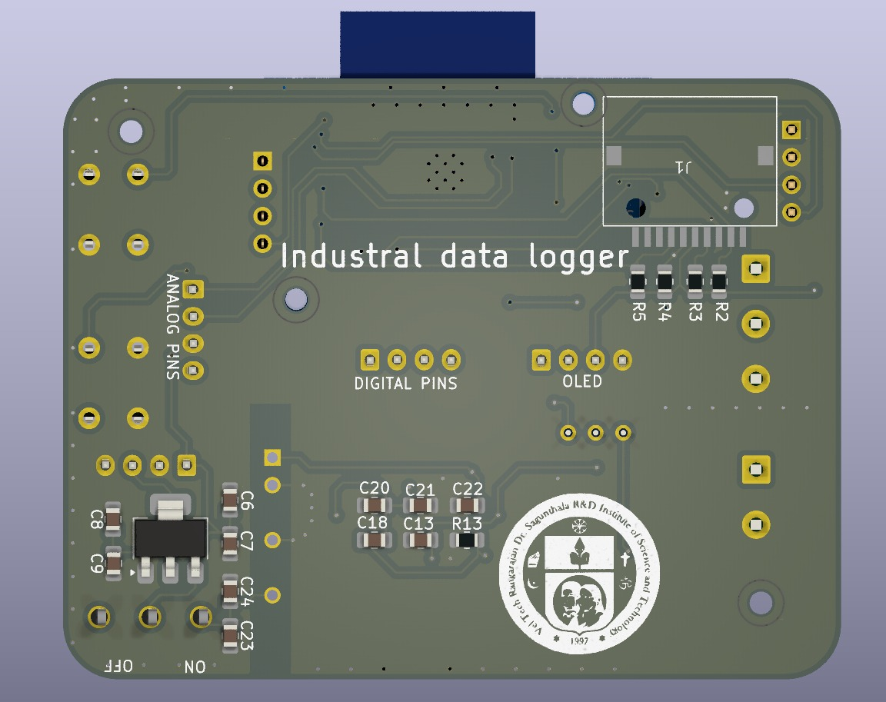

## 📌 IoT-Based Industrial Information Managerial System for Industry 4.0

This project presents a smart **Industrial Information Management System** designed to meet the data-driven demands of **Industry 4.0**. The system utilizes the **ESP32 microcontroller** to acquire real-time industrial parameters from multiple industrial sensors via the **Modbus RS485 protocol**. It stores data locally on a **micro-SD card** with precise time-stamping through an **RTC module**, ensuring continuous data logging even during network failure. The ESP32 also communicates with the **ThingsBoard cloud platform** over **MQTT**, enabling remote monitoring and advanced analytics such as forecasting and predictive maintenance.

---

## 🚀 Features
| Feature | Description |
|--------|-------------|
| Real-time data acquisition | Modbus RS485 industrial sensors |
| Reliable time-stamping | RTC module for accurate date/time |
| Uninterrupted logging | micro-SD card storage during network downtime |
| Cloud dashboard | ThingsBoard integration via MQTT |
| Remote analytics | Supports predictive maintenance & ML analysis |
| Scalable & low-power | Suitable for industrial and remote deployments |

---

## 🖼 PCB Images

---

## 🎥 Demo Video
🔗 **Project Demonstration:**  
[Watch Demo Video](https://drive.google.com/file/d/1XV2vE1A_jym7hIYn_06BnTkPzFkSEC-s/view?usp=sharing)
---

## 📄 Documentation
| File | Link |
|------|------|
| 📌 IEEE Paper | (./IEEE_DATA_LOGGER_PAPER.pdf) |
| 📌 Project PPTX | (./Data Logger PPT.pptx) |

---

## 🏗 Hardware Used
- ESP32 Development Board  
- RS485 to TTL Module  
- RTC Module (DS3231 / DS1307)  
- micro-SD Card Module  
- Industrial Sensors  
- Power Supply Unit 

---

## 🔧 Software Used
- Arduino IDE  
- ThingsBoard Cloud Platform  
- MQTT Protocol  
- GitHub  

---

